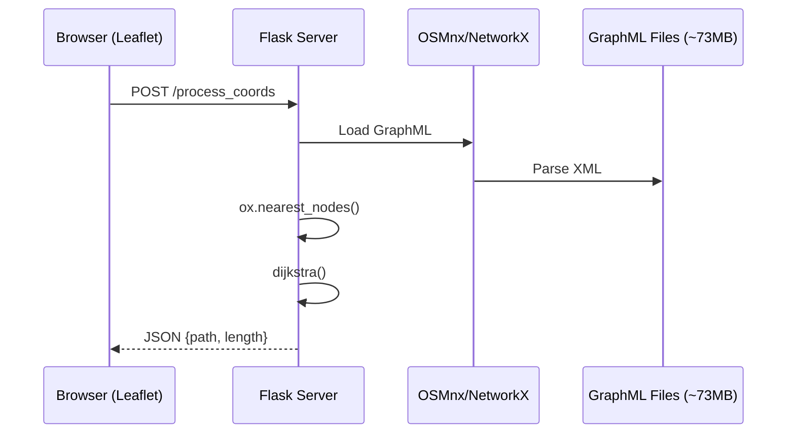
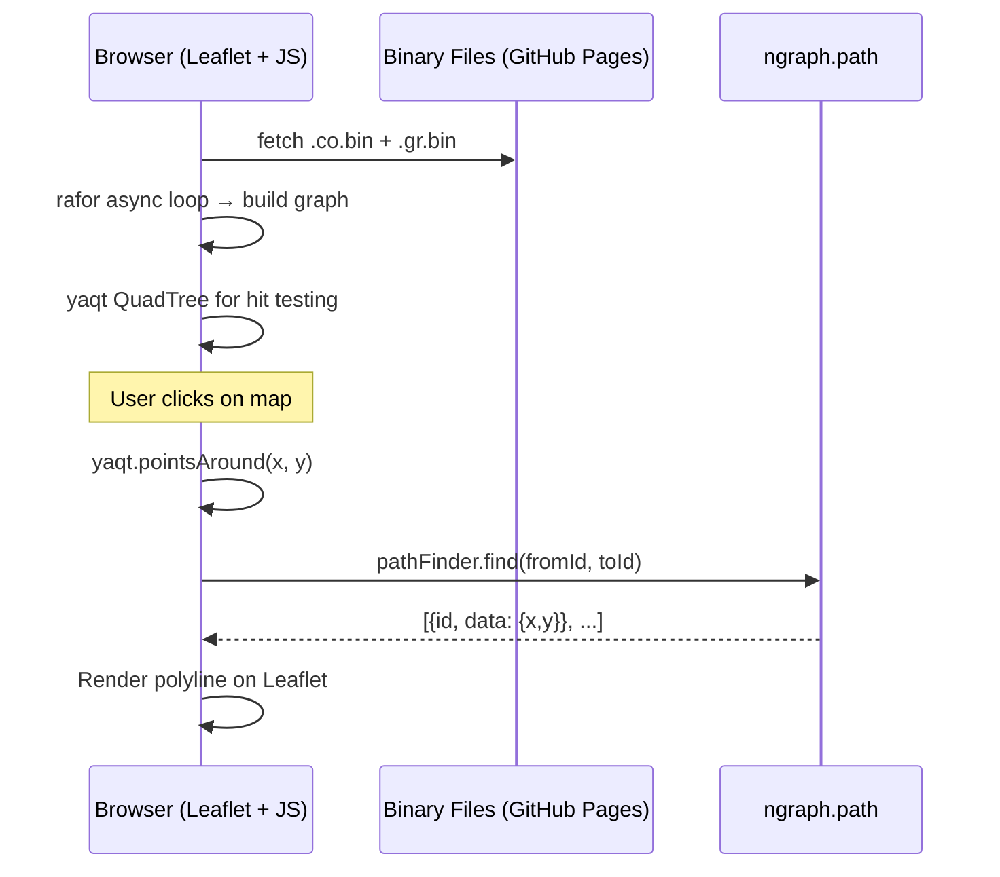

# E-Bike NCR: Client-Side Routing Implementation Plan

Transform the `pipluppp-ebike-ncr` Flask application into a fully client-side, static web application deployable to GitHub Pages.

---

## Current State Analysis

### Server-Side Architecture (Before)


### Key Files
| File | Purpose | Size |
|------|---------|------|
| [app.py](file:///c:/Users/Duncan/Desktop/ebayk/app.py) | Flask server, loads graphs, `/process_coords` endpoint | 1.8KB |
| [dijkstra.py](file:///c:/Users/Duncan/Desktop/ebayk/dijkstra.py) | Dijkstra shortest path + path reconstruction | 1.9KB |
| [index.html](file:///c:/Users/Duncan/Desktop/ebayk/templates/index.html) | Leaflet map, context menu, route visualization | 13KB |
| [metro_graph_without_prohibited.graphml](file:///c:/Users/Duncan/Desktop/ebayk/data/metro_graph_without_prohibited.graphml) | Main road network | **73MB** |
| [metro_graph_prohibited.graphml](file:///c:/Users/Duncan/Desktop/ebayk/data/metro_graph_prohibited.graphml) | Prohibited roads (for display) | **13MB** |

---

## Analysis of ngraph.path.demo

I evaluated the [anvaka/ngraph.path.demo](https://github.com/anvaka/ngraph.path.demo) repository and extracted several valuable patterns that significantly improve our implementation approach:

### Key Insights from ngraph.path.demo

| Aspect | ngraph.path.demo Approach | Benefit |
|--------|---------------------------|---------|
| **Data Format** | Binary files (`.co.bin`, `.gr.bin`) with `Int32Array` | **~50% smaller** than JSON, faster parsing |
| **Pathfinding** | `ngraph.path` library (A*, NBA*, Dijkstra) | Battle-tested, **5-8x faster** than manual Dijkstra |
| **Spatial Index** | `yaqt` QuadTree | Fast point lookup, async initialization |
| **Async Loading** | `rafor` library for async loops | **Non-blocking UI** during graph construction |
| **Graph Structure** | `ngraph.graph` | Optimized adjacency list, low memory footprint |
| **Rendering** | SVG overlay for path, WebGL for nodes | Leaflet already handles this for us ✓ |

### Performance Comparison (NYC graph: 733K edges, 264K nodes)

| Algorithm | Average | Median | Notes |
|-----------|---------|--------|-------|
| A* greedy | 32ms | 24ms | Fastest but suboptimal |
| NBA* | 44ms | 34ms | **Optimal, bi-directional** |
| A* unidirectional | 55ms | 38ms | Optimal, standard |
| Dijkstra | 264ms | 258ms | No heuristic |

> [!TIP]
> For Metro Manila (~100K-200K edges estimated), **NBA*** or **A* greedy** will be near-instantaneous (<50ms).

### Binary Format Specification (from ngraph.path.demo)

```
Coordinates file (.co.bin):
[x0, y0, x1, y1, x2, y2, ...] // Int32Array
// Node index = array_position / 2

Edges file (.gr.bin):  
[from0, to0, from1, to1, ...] // Int32Array
// Each pair is a directed edge
```

**Storage calculation:**
```
For V nodes and E edges:
size = V × 4 × 2 + E × 4 × 2 = (V + E) × 8 bytes
```

---

## Revised Architecture

### Client-Side Architecture (After)


---

## User Decisions Applied

| Decision | Choice | Implementation Impact |
|----------|--------|----------------------|
| Prohibited Roads | **Option C: Toggle** | Lazy-load GeoJSON only when user enables toggle |
| Web Worker | **Deferred** | Implement in main thread; add Worker if freezing occurs |

---

## Proposed Changes

### Phase 1: Data Engineering (Python)

#### [NEW] [scripts/export_graph_binary.py](file:///c:/Users/Duncan/Desktop/ebayk/scripts/export_graph_binary.py)

Export GraphML to binary format (ngraph.path.demo style).

```python
import osmnx as ox
import numpy as np
import struct

def export_graph_binary(input_path, output_prefix):
    """
    Export GraphML to binary format for ngraph.path consumption.
    
    Output:
    - {output_prefix}.co.bin: Node coordinates (Int32 x,y pairs)
    - {output_prefix}.gr.bin: Edge list (Int32 from,to pairs)
    """
    G = ox.load_graphml(input_path)
    
    # Create node ID mapping (OSM ID → 0-indexed integer)
    node_list = list(G.nodes())
    node_id_to_idx = {osm_id: idx for idx, osm_id in enumerate(node_list)}
    
    # Export coordinates
    # Note: We store in projected coordinates (meters) for accurate distance
    coords = []
    for osm_id in node_list:
        node = G.nodes[osm_id]
        # Store lng, lat as integers (multiplied for precision)
        # ngraph.path.demo uses projected coords; we'll use scaled lat/lng
        x = int(node['x'] * 1_000_000)  # 6 decimal places
        y = int(node['y'] * 1_000_000)
        coords.extend([x, y])
    
    # Write coordinates binary
    with open(f"{output_prefix}.co.bin", 'wb') as f:
        for val in coords:
            f.write(struct.pack('<i', val))  # little-endian int32
    
    # Export edges
    edges = []
    for u, v, data in G.edges(data=True):
        # ngraph uses 1-indexed IDs (subtract 1 on client)
        from_idx = node_id_to_idx[u] + 1
        to_idx = node_id_to_idx[v] + 1
        edges.extend([from_idx, to_idx])
    
    # Write edges binary
    with open(f"{output_prefix}.gr.bin", 'wb') as f:
        for val in edges:
            f.write(struct.pack('<i', val))
    
    print(f"Exported {len(node_list)} nodes, {len(edges)//2} edges")
    print(f"Coord file: {len(coords) * 4 / 1024:.1f} KB")
    print(f"Edge file: {len(edges) * 4 / 1024:.1f} KB")

if __name__ == "__main__":
    export_graph_binary(
        "data/metro_graph_without_prohibited.graphml",
        "static/data/metro-manila"
    )
```

#### [NEW] [scripts/export_prohibited_geojson.py](file:///c:/Users/Duncan/Desktop/ebayk/scripts/export_prohibited_geojson.py)

Export prohibited roads as static GeoJSON (for on-demand toggle loading).

```python
import osmnx as ox
import json

def export_prohibited_geojson(input_path, output_path):
    """Export prohibited roads as GeoJSON for optional client-side display."""
    G = ox.load_graphml(input_path)
    _, edges = ox.graph_to_gdfs(G, edges=True)
    
    # Simplify geometry to reduce file size
    geojson = json.loads(edges.to_json())
    
    # Remove unnecessary properties to minimize size
    for feature in geojson['features']:
        # Keep only essential properties
        props = feature.get('properties', {})
        feature['properties'] = {
            'name': props.get('name', ''),
            'highway': props.get('highway', '')
        }
    
    with open(output_path, 'w') as f:
        json.dump(geojson, f, separators=(',', ':'))  # Minified
    
    print(f"Exported to {output_path}")

if __name__ == "__main__":
    export_prohibited_geojson(
        "data/metro_graph_prohibited.graphml",
        "static/data/prohibited-roads.geojson"
    )
```

---

### Phase 2: Frontend Structure

#### New Directory Layout
```text
pipluppp-ebike-ncr/
├── index.html                    # [MODIFY] Remove Jinja, static entry
├── static/
│   ├── css/
│   │   ├── L.Control.Sidebar.css
│   │   ├── sidebar_styles.css
│   │   └── app.css               # [NEW] Extracted inline styles + loading UI
│   ├── data/
│   │   ├── metro-manila.co.bin   # [NEW] Node coordinates (binary)
│   │   ├── metro-manila.gr.bin   # [NEW] Edge list (binary)
│   │   └── prohibited-roads.geojson  # [NEW] Prohibited roads (lazy)
│   └── js/
│       ├── app.js                # [NEW] Main application logic
│       ├── loadGraph.js          # [NEW] Async binary loader (ngraph style)
│       ├── L.Control.Sidebar.js  # [MOVE]
│       └── button_toggle_visibility_sidebar.js  # [MOVE]
├── scripts/                      # [NEW] Python export scripts
│   ├── export_graph_binary.py
│   └── export_prohibited_geojson.py
└── data/                         # Keep for reference, not deployed
    └── *.graphml
```

---

### Phase 3: Routing Engine (JavaScript)

We'll use the **ngraph ecosystem** instead of implementing Dijkstra from scratch.

#### Dependencies (via CDN or bundler)

```html
<!-- ngraph ecosystem -->
<script src="https://unpkg.com/ngraph.graph@20.0.0/dist/ngraph.graph.umd.js"></script>
<script src="https://unpkg.com/ngraph.path@1.6.1/dist/ngraph.path.umd.js"></script>

<!-- Async loading helper -->
<script src="https://unpkg.com/rafor@1.0.2/dist/rafor.umd.js"></script>

<!-- Spatial indexing -->
<script src="https://unpkg.com/yaqt@1.2.1/yaqt.umd.js"></script>
```

#### [NEW] [static/js/loadGraph.js](file:///c:/Users/Duncan/Desktop/ebayk/static/js/loadGraph.js)

Async binary graph loader (adapted from ngraph.path.demo).

```javascript
// loadGraph.js - Async binary graph loader for Metro Manila routing

async function loadGraph(baseName, onProgress) {
    const graph = ngraphGraph(); // from ngraph.graph
    const graphBBox = { minX: Infinity, minY: Infinity, maxX: -Infinity, maxY: -Infinity };
    
    // 1. Load coordinates
    onProgress?.({ message: 'Loading node coordinates...', percent: 0 });
    const coordBuffer = await fetchBinary(`static/data/${baseName}.co.bin`, 
        (p) => onProgress?.({ message: 'Loading coordinates', percent: p * 0.4 }));
    const coords = new Int32Array(coordBuffer);
    
    // 2. Add nodes to graph (async to prevent UI freeze)
    onProgress?.({ message: 'Building node index...', percent: 40 });
    const points = []; // For QuadTree spatial index
    
    await asyncForEach(coords, 2, (x, i) => {
        const nodeId = Math.floor(i / 2);
        const y = coords[i + 1];
        
        // Convert back to lat/lng (stored as int * 1M)
        const lng = x / 1_000_000;
        const lat = y / 1_000_000;
        
        graph.addNode(nodeId, { x: lng, y: lat });
        points.push(lng, lat); // For QuadTree
        
        // Update bounding box
        graphBBox.minX = Math.min(graphBBox.minX, lng);
        graphBBox.maxX = Math.max(graphBBox.maxX, lng);
        graphBBox.minY = Math.min(graphBBox.minY, lat);
        graphBBox.maxY = Math.max(graphBBox.maxY, lat);
        
        if (i % 1000 === 0) {
            onProgress?.({ message: 'Building nodes', percent: 40 + (i / coords.length) * 20 });
        }
    });
    
    // 3. Load edges
    onProgress?.({ message: 'Loading road network...', percent: 60 });
    const edgeBuffer = await fetchBinary(`static/data/${baseName}.gr.bin`,
        (p) => onProgress?.({ message: 'Loading edges', percent: 60 + p * 20 }));
    const edges = new Int32Array(edgeBuffer);
    
    // 4. Add edges to graph
    onProgress?.({ message: 'Building road connections...', percent: 80 });
    await asyncForEach(edges, 2, (fromShifted, i) => {
        const fromId = fromShifted - 1; // Convert from 1-indexed
        const toId = edges[i + 1] - 1;
        graph.addLink(fromId, toId);
        
        if (i % 1000 === 0) {
            onProgress?.({ message: 'Building edges', percent: 80 + (i / edges.length) * 15 });
        }
    });
    
    onProgress?.({ message: 'Ready!', percent: 100 });
    
    return { graph, points, graphBBox };
}

// Helper: Fetch binary file with progress
async function fetchBinary(url, onProgress) {
    const response = await fetch(url);
    const reader = response.body.getReader();
    const contentLength = +response.headers.get('Content-Length');
    
    let receivedLength = 0;
    const chunks = [];
    
    while (true) {
        const { done, value } = await reader.read();
        if (done) break;
        
        chunks.push(value);
        receivedLength += value.length;
        onProgress?.(receivedLength / contentLength);
    }
    
    // Concatenate chunks
    const allBytes = new Uint8Array(receivedLength);
    let position = 0;
    for (const chunk of chunks) {
        allBytes.set(chunk, position);
        position += chunk.length;
    }
    
    return allBytes.buffer;
}

// Helper: Async for-each with chunking (prevents UI freeze)
function asyncForEach(array, step, callback) {
    return new Promise((resolve) => {
        let i = 0;
        
        function processChunk() {
            const startTime = performance.now();
            
            while (i < array.length) {
                callback(array[i], i, array);
                i += step;
                
                // Yield to browser every 16ms (60fps)
                if (performance.now() - startTime > 16) {
                    setTimeout(processChunk, 0);
                    return;
                }
            }
            
            resolve();
        }
        
        processChunk();
    });
}
```

#### [NEW] [static/js/app.js](file:///c:/Users/Duncan/Desktop/ebayk/static/js/app.js)

Main application logic with ngraph.path integration.

```javascript
// app.js - Metro Manila E-Bike Routing (Client-Side)

let graph = null;
let pathFinder = null;
let hitTestTree = null;
let prohibitedLayer = null;
let sourceCoordinates = null;
let targetCoordinates = null;

// DOM elements
const loadingOverlay = document.getElementById('loading-overlay');
const loadingMessage = document.getElementById('loading-message');
const loadingProgress = document.getElementById('loading-progress');
const prohibitedToggle = document.getElementById('prohibited-toggle');

// Initialize the application
async function init() {
    try {
        // Load graph with progress updates
        const { graph: loadedGraph, points, graphBBox } = await loadGraph('metro-manila', updateProgress);
        graph = loadedGraph;
        
        // Initialize pathfinder (NBA* for optimal bi-directional search)
        pathFinder = ngraphPath.nba(graph, {
            distance(fromNode, toNode, link) {
                // Euclidean distance as weight (could use road length)
                const dx = fromNode.data.x - toNode.data.x;
                const dy = fromNode.data.y - toNode.data.y;
                return Math.sqrt(dx * dx + dy * dy);
            },
            heuristic(fromNode, toNode) {
                // A* heuristic: straight-line distance to goal
                const dx = fromNode.data.x - toNode.data.x;
                const dy = fromNode.data.y - toNode.data.y;
                return Math.sqrt(dx * dx + dy * dy);
            }
        });
        
        // Initialize spatial index for click-to-node mapping
        hitTestTree = yaqt();
        await new Promise((resolve) => {
            hitTestTree.initAsync(points, {
                progress(i, total) {
                    if (i % 500 === 0) {
                        updateProgress({ message: 'Building spatial index', percent: 95 + (i/total) * 5 });
                    }
                },
                done: resolve
            });
        });
        
        // Hide loading overlay
        loadingOverlay.style.display = 'none';
        
        console.log(`Graph loaded: ${graph.getNodesCount()} nodes, ${graph.getLinksCount()} edges`);
        
    } catch (error) {
        loadingMessage.textContent = `Error: ${error.message}`;
        loadingProgress.style.backgroundColor = 'red';
        console.error('Failed to load graph:', error);
    }
}

function updateProgress({ message, percent }) {
    loadingMessage.textContent = message;
    loadingProgress.style.width = `${percent}%`;
}

// Find nearest graph node to a lat/lng coordinate
function findNearestNode(lat, lng) {
    if (!hitTestTree) return null;
    
    // yaqt uses x,y (lng,lat) order
    const results = hitTestTree.pointsAround(lng, lat, 0.01); // ~1km radius
    if (results.length === 0) {
        // Try larger radius
        return findNearestNodeWithRadius(lng, lat, 0.05);
    }
    
    // Find closest point
    let minDist = Infinity;
    let closestNodeId = null;
    
    for (const idx of results) {
        const nodeId = Math.floor(idx / 2);
        const node = graph.getNode(nodeId);
        if (!node) continue;
        
        const dx = node.data.x - lng;
        const dy = node.data.y - lat;
        const dist = dx * dx + dy * dy;
        
        if (dist < minDist) {
            minDist = dist;
            closestNodeId = nodeId;
        }
    }
    
    return closestNodeId;
}

function findNearestNodeWithRadius(lng, lat, radius) {
    const results = hitTestTree.pointsAround(lng, lat, radius);
    if (results.length === 0 && radius < 0.5) {
        return findNearestNodeWithRadius(lng, lat, radius * 2);
    }
    // ... same logic as above
    return null;
}

// Calculate route between source and target
function calculateRoute() {
    if (!sourceCoordinates || !targetCoordinates || !pathFinder) return null;
    
    const startNodeId = findNearestNode(sourceCoordinates.lat, sourceCoordinates.lng);
    const endNodeId = findNearestNode(targetCoordinates.lat, targetCoordinates.lng);
    
    if (startNodeId === null || endNodeId === null) {
        info.update(false);
        return null;
    }
    
    const startTime = performance.now();
    const path = pathFinder.find(startNodeId, endNodeId);
    const elapsed = performance.now() - startTime;
    
    console.log(`Route found in ${elapsed.toFixed(2)}ms`);
    
    if (path.length === 0) {
        info.update(false);
        return null;
    }
    
    // Convert path to Leaflet coordinates [[lat, lng], ...]
    const coords = path.map(node => [node.data.y, node.data.x]);
    
    // Calculate total distance
    let totalDistance = 0;
    for (let i = 1; i < path.length; i++) {
        const prev = path[i - 1].data;
        const curr = path[i].data;
        // Haversine distance in km
        totalDistance += haversineDistance(prev.y, prev.x, curr.y, curr.x);
    }
    
    return { coords, distance: totalDistance };
}

// Haversine formula for accurate distance
function haversineDistance(lat1, lon1, lat2, lon2) {
    const R = 6371; // Earth radius in km
    const dLat = (lat2 - lat1) * Math.PI / 180;
    const dLon = (lon2 - lon1) * Math.PI / 180;
    const a = Math.sin(dLat/2) ** 2 + 
              Math.cos(lat1 * Math.PI / 180) * Math.cos(lat2 * Math.PI / 180) * 
              Math.sin(dLon/2) ** 2;
    return R * 2 * Math.atan2(Math.sqrt(a), Math.sqrt(1-a));
}

// Toggle prohibited roads layer (lazy loading)
async function toggleProhibitedRoads() {
    if (prohibitedLayer) {
        // Layer exists, just toggle visibility
        if (map.hasLayer(prohibitedLayer)) {
            map.removeLayer(prohibitedLayer);
        } else {
            map.addLayer(prohibitedLayer);
        }
        return;
    }
    
    // First time: load the GeoJSON
    prohibitedToggle.disabled = true;
    prohibitedToggle.textContent = 'Loading...';
    
    try {
        const response = await fetch('static/data/prohibited-roads.geojson');
        const geojson = await response.json();
        
        prohibitedLayer = L.geoJSON(geojson, {
            style: {
                color: "#3d3d47",
                weight: 2,
                opacity: 0.8
            }
        });
        
        prohibitedLayer.addTo(map);
        prohibitedToggle.textContent = 'Hide Prohibited Roads';
        
    } catch (error) {
        console.error('Failed to load prohibited roads:', error);
        prohibitedToggle.textContent = 'Failed to load';
    } finally {
        prohibitedToggle.disabled = false;
    }
}

// Start the application
init();
```

---

### Phase 4: UI Integration

#### [MODIFY] [index.html](file:///c:/Users/Duncan/Desktop/ebayk/index.html)

Move from `templates/` to root. Key changes:

1. **Remove all Jinja/Flask syntax**
2. **Add loading overlay with progress bar**
3. **Add prohibited roads toggle button**
4. **Replace fetch(`/process_coords`) with local `calculateRoute()`**

```html
<!DOCTYPE html>
<html lang="en">
<head>
    <title>E-Bike Routing - Metro Manila</title>
    <link rel="stylesheet" href="https://unpkg.com/leaflet@1.9.4/dist/leaflet.css" />
    <link rel="stylesheet" href="static/css/app.css" />
    <link rel="stylesheet" href="static/css/sidebar_styles.css" />
</head>
<body>
    <!-- Loading Overlay -->
    <div id="loading-overlay">
        <div class="loading-content">
            <h2>E-Bike Routing</h2>
            <p id="loading-message">Initializing...</p>
            <div class="progress-bar">
                <div id="loading-progress"></div>
            </div>
        </div>
    </div>

    <!-- Sidebar with toggle button for prohibited roads -->
    <div id="sidebar">
        <!-- ... existing sidebar content ... -->
        <button id="prohibited-toggle" onclick="toggleProhibitedRoads()">
            Show Prohibited Roads
        </button>
    </div>

    <div id="map"></div>
    
    <!-- Context Menu (unchanged) -->
    <div id="context-menu" class="context-menu">
        <div class="context-menu-item context-menu-coords" id="coordinates"></div>
        <div class="context-menu-item" id="directions-from">Directions from here</div>
        <div class="context-menu-item" id="directions-to">Directions to here</div>
    </div>

    <!-- Dependencies -->
    <script src="https://unpkg.com/leaflet@1.9.4/dist/leaflet.js"></script>
    <script src="https://unpkg.com/ngraph.graph@20.0.0/dist/ngraph.graph.umd.js"></script>
    <script src="https://unpkg.com/ngraph.path@1.6.1/dist/ngraph.path.umd.js"></script>
    <script src="https://unpkg.com/yaqt@1.2.1/yaqt.umd.js"></script>
    
    <!-- Application -->
    <script src="static/js/loadGraph.js"></script>
    <script src="static/js/app.js"></script>
</body>
</html>
```

#### [NEW] [static/css/app.css](file:///c:/Users/Duncan/Desktop/ebayk/static/css/app.css)

Loading overlay and extracted styles.

```css
/* Loading Overlay */
#loading-overlay {
    position: fixed;
    top: 0;
    left: 0;
    width: 100%;
    height: 100%;
    background: rgba(26, 26, 26, 0.95);
    display: flex;
    align-items: center;
    justify-content: center;
    z-index: 9999;
}

.loading-content {
    text-align: center;
    color: #c0beb6;
    font-family: 'Roboto', sans-serif;
}

.loading-content h2 {
    margin-bottom: 1rem;
    color: #fdd036;
}

.progress-bar {
    width: 300px;
    height: 8px;
    background: rgba(255, 255, 255, 0.1);
    border-radius: 4px;
    overflow: hidden;
    margin-top: 1rem;
}

#loading-progress {
    height: 100%;
    width: 0%;
    background: linear-gradient(90deg, #fdd036, #b45513);
    transition: width 0.3s ease;
}

/* Prohibited roads toggle */
#prohibited-toggle {
    margin-top: 1rem;
    padding: 8px 16px;
    background: rgba(255, 255, 255, 0.1);
    border: 1px solid rgba(255, 255, 255, 0.2);
    color: #c0beb6;
    border-radius: 4px;
    cursor: pointer;
    transition: background 0.2s;
}

#prohibited-toggle:hover {
    background: rgba(255, 255, 255, 0.2);
}

#prohibited-toggle:disabled {
    opacity: 0.5;
    cursor: not-allowed;
}
```

---

### Phase 5: Optimization (Deferred)

> [!NOTE]
> Per user decision, Web Worker implementation is deferred. If testing reveals UI freezes >200ms during routing, we can move the pathfinding to a Worker.

---

## Verification Plan

### Automated Tests

1. **Data Export Validation** (Python)
   ```bash
   python scripts/export_graph_binary.py
   # Verify: static/data/metro-manila.co.bin exists
   # Verify: static/data/metro-manila.gr.bin exists
   # Check file sizes (expect: co.bin ~2-4MB, gr.bin ~3-6MB)
   ```

2. **Graph Loading Test** (Browser Console)
   ```javascript
   console.log(`Nodes: ${graph.getNodesCount()}`);  // Expected: 50K-200K
   console.log(`Edges: ${graph.getLinksCount()}`);  // Expected: 80K-300K
   ```

3. **Route Calculation Test** (Browser Console)
   ```javascript
   // Known route: Quezon Memorial Circle → SM North EDSA
   sourceCoordinates = { lat: 14.6516, lng: 121.0493 };
   targetCoordinates = { lat: 14.6570, lng: 121.0309 };
   const result = calculateRoute();
   console.assert(result !== null, "Route should exist");
   console.assert(result.coords.length > 5, "Path should have multiple points");
   console.log(`Distance: ${result.distance.toFixed(2)} km`);
   ```

4. **Spatial Query Test**
   ```javascript
   const nodeId = findNearestNode(14.6488, 121.0509); // QC Hall
   console.assert(nodeId !== null, "Should find nearest node");
   const node = graph.getNode(nodeId);
   console.log(`Found node at: ${node.data.y}, ${node.data.x}`);
   ```

### Manual Verification

- [ ] Deploy to GitHub Pages test branch
- [ ] Test loading on slow 3G (Chrome DevTools throttling)
- [ ] Test route: Makati → Quezon City (long route, ~15km)
- [ ] Test route: Intramuros → Ermita (short route, ~2km)
- [ ] Test on mobile device (Chrome Android)
- [ ] Verify prohibited roads toggle loads and displays correctly
- [ ] Measure initial load time (target: <5s on 4G)
- [ ] Measure route calculation time (target: <100ms)

---

## Implementation Order


| Phase | Estimated Effort | Dependencies |
|-------|------------------|--------------|
| Phase 1: Data Export | 1-2 hours | Python + OSMnx |
| Phase 2: Directory Restructure | 30 min | Phase 1 |
| Phase 3: Routing Engine | 2-3 hours | Phase 2 |
| Phase 4: UI Integration | 2-3 hours | Phase 3 |
| Phase 5: Web Worker | 1-2 hours | **Only if needed** |
| **Total** | **6-10 hours** | |

---

## Risks & Mitigations

| Risk | Likelihood | Impact | Mitigation |
|------|------------|--------|------------|
| Binary files too large | Low | Medium | ngraph format is efficient; GZIP on GH Pages |
| Pathfinding slow on large graph | Low | Medium | Use NBA* (bi-directional A*); defer Web Worker |
| yaqt/ngraph CDN unavailable | Low | High | Bundle locally as fallback |
| Coordinate precision loss | Medium | Low | Use 6 decimal places (int × 1M) |
| Edge weights missing | Medium | Medium | Use Euclidean distance; accurate for Metro Manila scale |

---

## Summary of Changes from Initial Plan

| Aspect | Initial Plan | Revised Plan |
|--------|--------------|--------------|
| **Data Format** | JSON with polylines | **Binary** (Int32Array) |
| **Pathfinding** | Manual Dijkstra | **ngraph.path** (NBA*/A*) |
| **Spatial Index** | KDBush | **yaqt** (QuadTree) |
| **Loading** | Synchronous | **Async with rafor pattern** |
| **Edge Weight** | Length from GraphML | Euclidean distance |
| **Prohibited Roads** | Static Jinja inject | **Lazy-load toggle** |
| **Progress UI** | None | **Loading overlay with progress** |
